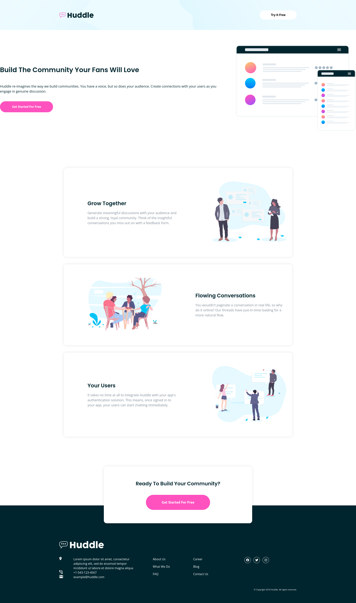

# Frontend Mentor - Huddle Landing Page with alternating feature blocks 

Huddle landing page with alternating feature blocks design from the website Frontend Mentor.

https://www.frontendmentor.io/challenges/huddle-landing-page-with-alternating-feature-blocks-5ca5f5981e82137ec91a5100

Likewise in the last project, I used a lot of nested divs using flex and I used grid on the footer element with the help of griddy.io.

This is the preview I made:

Desktop version:

Mobile version:

Live: https://billgeorgop93.github.io/Huddle-Landing-Page-with-alternating-feature-blocks/
